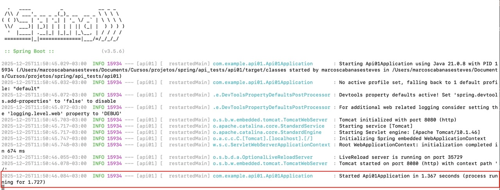

# Spring Boot Test API - API01

Este repositório foi criado para **aprender e praticar Spring Boot**, servindo como um espaço pessoal para explorar como funcionam as APIs REST.

---

## 🚀 Objetivo

Aprender os conceitos básicos de **Spring Boot**:
- Criar e executar uma API local  
- Definir endpoints com `@RestController`  
- Retornar respostas em texto e JSON  
- Entender a estrutura do projeto e o uso do Maven  

---

## 🏗️ Tecnologias Utilizadas

- **Java 17**  
- **Spring Boot 3.x**  
- **Maven**  
- **IDE:** VS Code  

---

## ▶️ Como Executar o Projeto

1. **Clone este repositório:**
   ```bash
   git clone https://github.com/marcoscesteves/api-tests.git
   cd api_tests/api01
   ```

2. **Execute o servidor:**
   ```bash
   mvn spring-boot:run
   ```

   O log abaixo avisará que a aplicação está disponível.  
   


3. **Abra a aplicação no navegador:**
   ```
   http://localhost:8080/hello
   ```

   Uma mensagem de confirmação será exibida confirmando que a API está funcional.  
   

4. **O que aprendemos neste exercício:**

    **i) @RestController**
    - Marca a classe como um controlador REST
    - Combina `@Controller` + `@ResponseBody`
    - Todos os métodos retornam dados diretamente (não views HTML)

    **ii) @GetMapping("hello")**
    - Mapeia requisições HTTP GET para o caminho `/hello`
    - Define qual método será executado quando acessarmos essa URL
    - Parte do Spring MVC para criar endpoints REST

    **iii) Retorno String**
    - Método retorna uma String simples
    - Spring automaticamente converte para resposta HTTP
    - Texto puro é enviado ao navegador

5. **Interrompa o serviço:**
   Interrompa a execução do servidor e vá para o exercício 02 (api_tests/api02)
