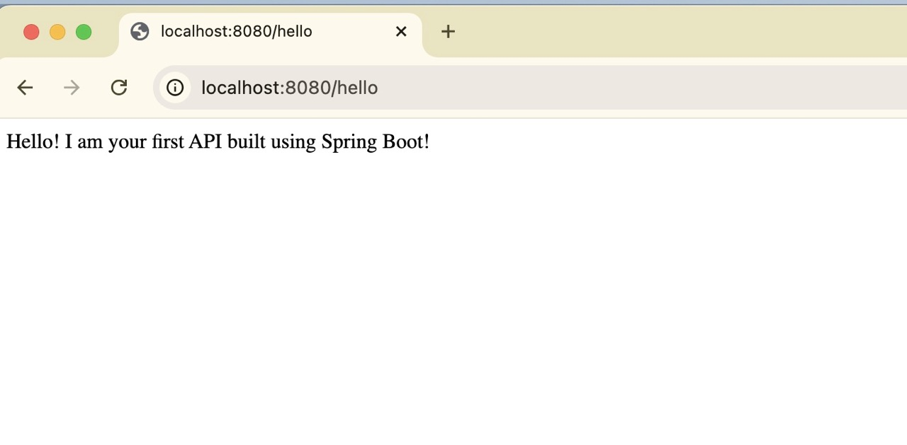
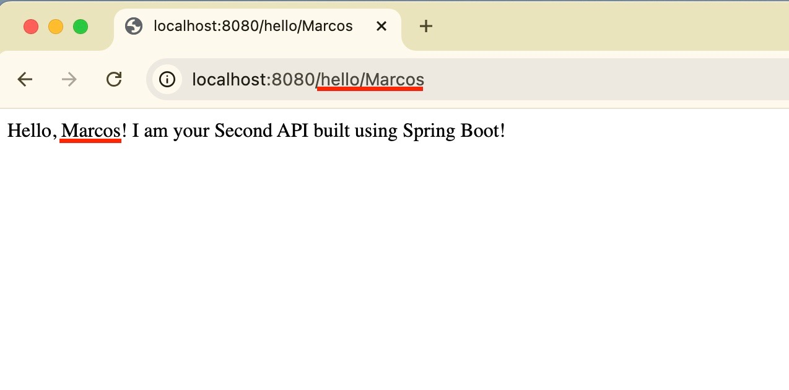

# 🧪 Spring Boot Test API - PT 02

1) Nesta API a ideia é receber o nome do usuário através da URL e imprimir na tela. Sendo uma versão que nos permitirá aprender um pouco mais além do que fizemos na primeira API.

2) Na primeira API construída, nós somente "subimos" o servidor. Neste exercício, agora, vamos conhecer melhor o que estava rodando por trás dos panos.

3) No exercício 01 (api01) obtivemos o seguinte resultado em tela:

    

4) Esta tela inicial padrão é realizar através do seguinte código (/api_tests/api01/src/main/java/com/example/api01/ApiController.java):

    ```
    package com.example.api01;

    import org.springframework.web.bind.annotation.GetMapping;
    import org.springframework.web.bind.annotation.RestController;

    @RestController
    public class ApiController {
        
        @GetMapping("hello")
        public String hello() {
            return "Hello! I am your first API built using Spring Boot! ";
        } 
        
    }
    ```

5) Quais melhorias faremos nesta versão? Repare nas linhas ressaltadas abaixo: 

    ```diff
    package com.example.api02;

    import org.springframework.web.bind.annotation.GetMapping;
    import org.springframework.web.bind.annotation.RestController;

    @RestController
    public class ApiController {
    

    +   @GetMapping("hello/{name}")
    +   public String hello(@PathVariable String name) {
    +        return "Hello, " + name + "! I am your Second API built using Spring Boot! ";
        } 
        
    }
    ```

6) Para executar o projeto sempre verifique se você está na pasta que contém o arquivo pom.xml. Em nosso projeto, este arquivo se encontra na pasta api02. Faça a execução através deste comando:
    ```bash
    mvn clean package
    mvn spring-boot:run
    ```

7) Teste o servidor
    

8) O que aprendemos neste exercício:
Repare nas alterações em relação à primeira API que fizemos e tente entender as diferenças:

    i) @GetMapping("hello") -> @getMapping("hello/{name})
    @GetMapping("hello/{name}") é uma anotação do Spring MVC que:
    - Mapeia um endpoint HTTP GET,
    - Tendo por referência o caminho hello/{name},
    - Onde {name} é um segmento variável da URL.

    ii) @PathVariable String name 
    PathVariable é a anotação do Spring MVC que diz: “pegue o valor que está no caminho da URL e coloque neste parâmetro do método”.

    Como o funciona isso ?
    Quando chega uma requisição GET para uma URL que possui esse padrão (hello/{name}), o Spring chama o método anotado e injeta o valor de {name} no parâmetro marcado com @PathVariable.

9) Feche o servidor aberto e vá para exercício 03 (api_testes/api03)


