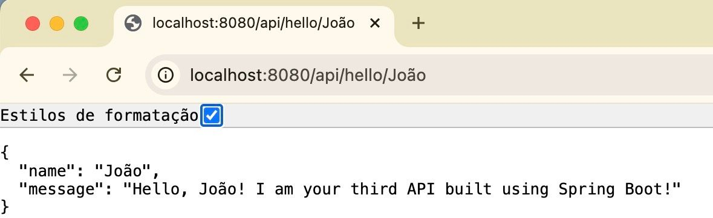

# Spring Boot Test API - API03

1) Nesta API a ideia é receber o nome do usuário através da URL e imprimir na tela o conteúdo recebido em formato JSON.

2) Como estava nosso código na segunda API:

    ```
    package com.example.api02;

    import org.springframework.web.bind.annotation.GetMapping;
    import org.springframework.web.bind.annotation.RestController;

    @RestController
    public class ApiController {
        

    @GetMapping("hello/{name}")
    public String hello(@PathVariable String name) {
            return "Hello, " + name + "! I am your Second API built using Spring Boot! ";
        } 
        
    }
    ```

3) Quais alterações vamos fazer?

    ```diff
    package com.example.api03;

    import org.springframework.web.bind.annotation.GetMapping;
    import org.springframework.web.bind.annotation.RestController;
    import org.springframework.web.bind.annotation.RequestMapping;
    import org.springframework.web.bind.annotation.PathVariable;

    @RestController
    + @RequestMapping("api")
    public class ApiController {
        
        @GetMapping("hello/{name}")
    +    public Greeting hello(@PathVariable String name) {
    +        return new Greeting(
    +            name,
    +            "Hello, " + name + "! I am your third API built using Spring Boot!"
            );
        } 

    +    public record Greeting(String name, String message) {}
        
    }
    ```

4) Para executar o projeto sempre verifique se você está na pasta que contém o arquivo pom.xml. Em nosso projeto, este arquivo se encontra na pasta api03. Faça a execução através deste comando:
    ```bash
    mvn clean package
    mvn spring-boot:run
    ```

5) Importante agora temos de acessar o endereço http://localhost:8080/api/hello/ (ao invés de http://localhost:8080/hello/)

    

6) O que aprendemos neste exercício:

    **i) Entendendo tipos de retorno e nomes de métodos**
    ```java
    public Greeting hello(@PathVariable String name) {
    //     ↑         ↑
    //   TIPO      NOME DO MÉTODO
        return new Greeting(...);
    }
    ```
    - **Nome do método**: `hello` (verbo, ação)
    - **Tipo de retorno**: `Greeting` (substantivo, tipo do record)
    - O método `hello` **retorna** um objeto do tipo `Greeting`
    - Spring converte automaticamente o record em JSON

    **ii) @RequestMapping("api")**
    - Define um **prefixo de rota** para todos os endpoints da classe
    - Agrupa endpoints relacionados sob um caminho comum
    - URL muda de `http://localhost:8080/hello/João` para `http://localhost:8080/api/hello/João`
    - Boa prática para organizar APIs REST

    **iii) public record Greeting(String name, String message) {}**
    - **Record** é uma classe especial do Java (desde Java 14)
    - Forma compacta de criar objetos imutáveis
    - Substitui classes com getters, equals, hashCode e toString automáticos
    - Perfeito para representar dados (DTOs)

    **iv) Retorno de objetos como JSON**
    - Método agora retorna `Greeting` (não mais `String`)
    - Spring Boot automaticamente converte o objeto em JSON
    - Jackson (biblioteca) faz a serialização
    - Resultado: `{"name":"João","message":"Hello, João!..."}` 

7) Feche o servidor em execução e vá para o exercício 04.