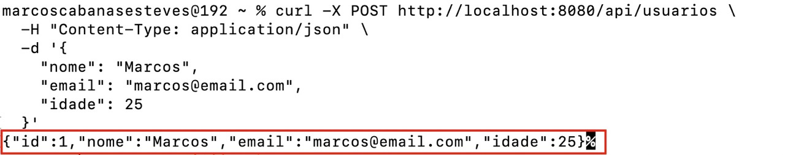
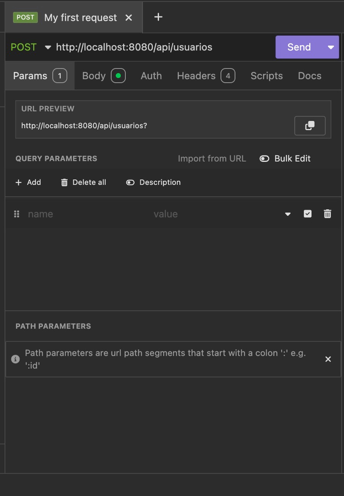
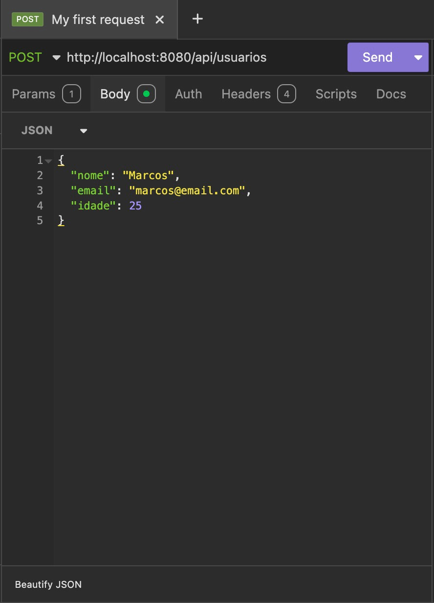
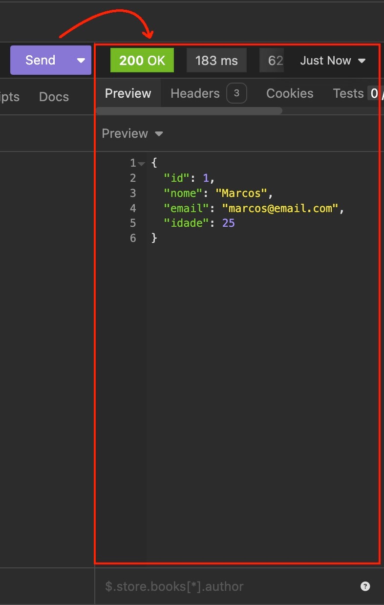
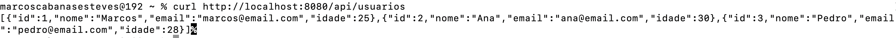

# Spring Boot Test API - API05

1)  Nas atividades anteriores (API01 até API04) trabalhamos com a leitura de dados do servidor (método GET). Nesta atividade (API05) vamos aprender a **criar recursos** usando o método **POST**. 

2) Como estava nosso código na quarta API:

    ```java
    package com.example.api04;

    import org.springframework.web.bind.annotation.GetMapping;
    import org.springframework.web.bind.annotation.RestController;
    import org.springframework.web.bind.annotation.RequestMapping;
    import org.springframework.web.bind.annotation.RequestParam;

    @RestController
    @RequestMapping("api")
    public class ApiController {
        
        @GetMapping("buscar")
        public SearchResult buscar(
            @RequestParam String nome,
            @RequestParam(required = false) Integer idade
        ) {
            String mensagem;
            if (idade != null) {
                mensagem = String.format("Buscando por: %s, %d anos", nome, idade);
            } else {
                mensagem = String.format("Buscando por: %s", nome);
            }
            return new SearchResult(nome, idade, mensagem);
        }

        public record SearchResult(String nome, Integer idade, String mensagem) {}
    }
    ```

3) Quais alterações vamos fazer?

    ```diff
    package com.example.api05;

    import org.springframework.web.bind.annotation.GetMapping;
    + import org.springframework.web.bind.annotation.PostMapping;
    + import org.springframework.web.bind.annotation.RequestBody;
    import org.springframework.web.bind.annotation.RestController;
    import org.springframework.web.bind.annotation.RequestMapping;
    + import java.util.ArrayList;
    + import java.util.List;

    @RestController
    @RequestMapping("api/usuarios")
    public class ApiController {
        
    +    // Lista em memória para armazenar os usuários
    +    private List<Usuario> usuarios = new ArrayList<>();
    +    private Long proximoId = 1L;
        
    +    // POST - Criar um novo usuário
    +    @PostMapping
    +    public Usuario criar(@RequestBody Usuario usuario) {
    +        usuario.setId(proximoId++);
    +        usuarios.add(usuario);
    +        return usuario;
    +    }
    +    
    +    // GET - Listar todos os usuários
    +    @GetMapping
    +    public List<Usuario> listar() {
    +        return usuarios;
    +    }
    }
    ```

4) **O que é POST?**
   - POST é usado para **criar** novos recursos no servidor
   - Os dados são enviados no **corpo da requisição** (body), não na URL
   - Usamos `@PostMapping` para definir um endpoint POST
   - Usamos `@RequestBody` para receber os dados enviados

5) **O que é essa lista em memória?**
   - Por enquanto, para simplificar o debate, não estamos trabalhando com banco de dados. 
   - Usamos um `ArrayList` para guardar os dados temporariamente
   - Os dados ficam salvos **apenas enquanto o servidor está rodando**
   - Se reiniciar o servidor, perde tudo 
   - Em aulas futuras realizaremos esta mesma atividade, só que gravando em um banco de dados, o que aproxima a atividade de um caso mais real.

6) **Estrutura completa do código:**

    ```java
    package com.example.api05;

    import org.springframework.web.bind.annotation.GetMapping;
    import org.springframework.web.bind.annotation.PostMapping;
    import org.springframework.web.bind.annotation.RequestBody;
    import org.springframework.web.bind.annotation.RestController;
    import org.springframework.web.bind.annotation.RequestMapping;
    import java.util.ArrayList;
    import java.util.List;

    @RestController
    @RequestMapping("api/usuarios")
    public class ApiController {
        
        // Lista em memória para armazenar os usuários
        private List<Usuario> usuarios = new ArrayList<>();
        private Long proximoId = 1L;
        
        // POST - Criar um novo usuário
        @PostMapping
        public Usuario criar(@RequestBody Usuario usuario) {
            usuario.setId(proximoId++);
            usuarios.add(usuario);
            return usuario;
        }
        
        // GET - Listar todos os usuários
        @GetMapping
        public List<Usuario> listar() {
            return usuarios;
        }
    }
    ```

7) **Classe Usuario:**

    ```java
    package com.example.api05;

    public class Usuario {
        private Long id;
        private String nome;
        private String email;
        private Integer idade;

        // Construtores
        public Usuario() {}
        
        public Usuario(Long id, String nome, String email, Integer idade) {
            this.id = id;
            this.nome = nome;
            this.email = email;
            this.idade = idade;
        }

        // Getters e Setters
        public Long getId() {
            return id;
        }

        public void setId(Long id) {
            this.id = id;
        }

        public String getNome() {
            return nome;
        }

        public void setNome(String nome) {
            this.nome = nome;
        }

        public String getEmail() {
            return email;
        }

        public void setEmail(String email) {
            this.email = email;
        }

        public Integer getIdade() {
            return idade;
        }

        public void setIdade(Integer idade) {
            this.idade = idade;
        }
    }
    ```

---

## 🎯 O que você vai aprender

- ✅ Como usar `@PostMapping` para criar recursos
- ✅ Como receber dados JSON com `@RequestBody`
- ✅ Como armazenar dados em memória (ArrayList)
- ✅ Como gerar IDs automaticamente
- ✅ Como criar e retornar novos objetos

---

## ▶️ Como Executar o Projeto

1. **Entre na pasta do projeto:**
   ```bash
   cd api05
   ```

2. **Execute o projeto:**
   ```bash
   mvn spring-boot:run
   ```

3. **O servidor vai iniciar em:** `http://localhost:8080`

---

## 🧪 Como Testar os Endpoints

### 1️⃣ Criar um usuário (POST)

**Usando cURL:**

> **O que é cURL?** É uma ferramenta de linha de comando para fazer requisições HTTP. Vem instalada por padrão no Linux, Mac e Windows 10/11 (a partir de 2018).

```bash
curl -X POST http://localhost:8080/api/usuarios \
  -H "Content-Type: application/json" \
  -d '{
    "nome": "Marcos",
    "email": "marcos@email.com",
    "idade": 25
  }'
```

**Resultado esperado:**

)

**Usando Insomnia:**

<table>
<tr>
<td></td>
<td></td>
</tr>
</table>

- **Método:** POST
- **URL:** `http://localhost:8080/api/usuarios`
- **Headers:** `Content-Type: application/json`
- **Body (raw JSON):**
  ```json
  {
    "nome": "Marcos",
    "email": "marcos@email.com",
    "idade": 25
  }
  ```

)

### 2️⃣ Criar mais usuários
Abaixo coloquei a criação de outros usuários, apenas usando o curl, mas o mesmo pode ser feito usando o insomnia, basta seguir os exemplos acima.

```bash
curl -X POST http://localhost:8080/api/usuarios \
  -H "Content-Type: application/json" \
  -d '{
    "nome": "Ana",
    "email": "ana@email.com",
    "idade": 30
  }'
```

```bash
curl -X POST http://localhost:8080/api/usuarios \
  -H "Content-Type: application/json" \
  -d '{
    "nome": "Pedro",
    "email": "pedro@email.com",
    "idade": 28
  }'
```

### 3️⃣ Listar todos os usuários (GET)

**Usando cURL:**
```bash
curl http://localhost:8080/api/usuarios
```


**Usando o navegador:**
```
http://localhost:8080/api/usuarios
```

**Resultado esperado:**
```json
[
  {
    "id": 1,
    "nome": "Marcos",
    "email": "marcos@email.com",
    "idade": 25
  },
  {
    "id": 2,
    "nome": "Ana",
    "email": "ana@email.com",
    "idade": 30
  },
  {
    "id": 3,
    "nome": "Pedro",
    "email": "pedro@email.com",
    "idade": 28
  }
]
```

---

## 📝 Conceitos Importantes

### @PostMapping
Indica que o método vai receber requisições POST. POST é usado para **criar** novos recursos.

### @RequestBody
Indica que o parâmetro virá do **corpo da requisição** em formato JSON. O Spring converte automaticamente o JSON em um objeto Java.

### Content-Type: application/json
Header HTTP que indica que estamos enviando dados em formato JSON.

### Lista em Memória
Usamos `ArrayList` para guardar os dados temporariamente. É perfeito para aprender, mas os dados se perdem ao reiniciar o servidor.

### Geração de ID
Usamos uma variável `proximoId` que incrementa a cada novo usuário criado, garantindo IDs únicos.

---

## 🎓 Próximos Passos

Na **API06** vamos:
- Buscar um usuário específico por ID (GET com PathVariable)
- Entender melhor como trabalhar com listas
- Aprender sobre códigos de status HTTP (200, 404)

---

## 📚 Dicas

- **Reinicie o servidor:** Os dados em memória se perdem. É normal!
- **Teste bastante:** Crie vários usuários e liste para ver como funciona
- **Use Postman/Insomnia:** Facilita muito testar APIs POST
- **Veja os logs:** O console mostra informações úteis sobre as requisições

---

## 💡 Desafio Extra (Opcional)

Tente adicionar um novo endpoint:
```java
@GetMapping("/total")
public int total() {
    return usuarios.size();
}
```

Teste em: `http://localhost:8080/api/usuarios/total`
